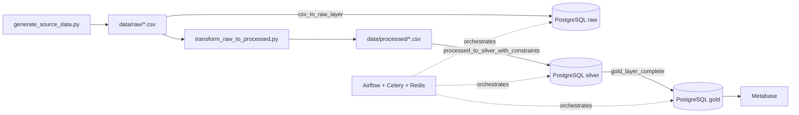
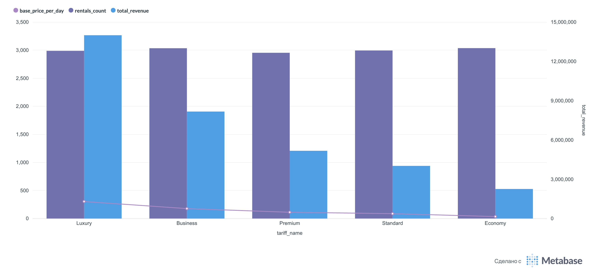
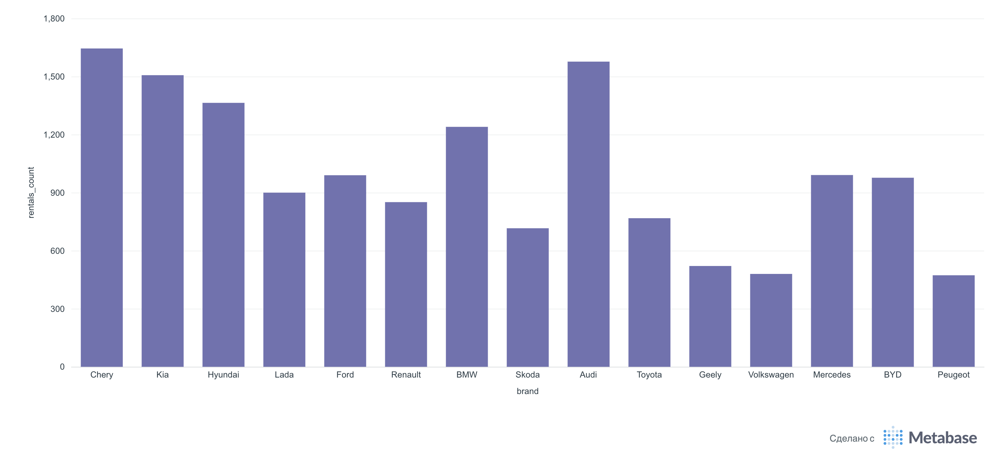
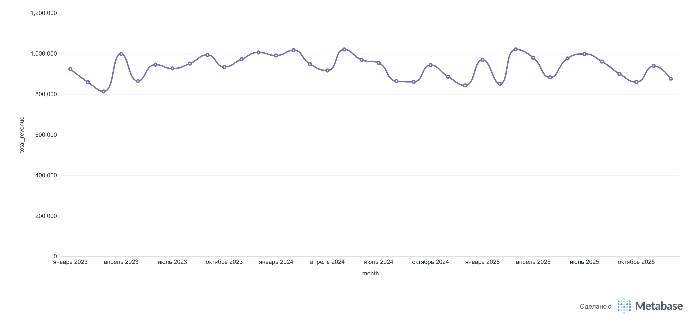
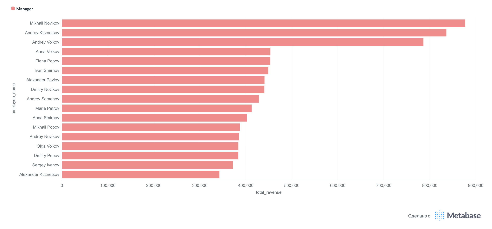

# Rental Car Analytics Platform

End-to-end платформа данных для сервиса аренды автомобилей. Система объединяет сведения об автопарке, клиентах, сотрудниках, тарифах, арендах, платежах и техническом состоянии машин в PostgreSQL DWH. Данные проходят очистку и контроль целостности, преобразуются в аналитическую модель и становятся доступны для управленческой аналитики в Metabase. Загрузки оркестрируются Apache Airflow с CeleryExecutor.

## Возможности платформы

Платформа обеспечивает:

- генерацию согласованного набора данных по автомобилям, клиентам, сотрудникам, тарифам, арендам, платежам и состоянию автопарка;
- очистку аномалий, нормализацию дат и чисел, обработку пропусков и расчёт признаков просрочки;
- пакетную загрузку CSV в PostgreSQL через `COPY`;
- разделение DWH на слои `raw`, `silver` и `gold`;
- контроль целостности silver-слоя первичными и внешними ключами;
- построение звездообразной модели и индексов для аналитических запросов;
- локальный аналитический стек на Docker Compose: Airflow, PostgreSQL, Redis и Metabase.

## Архитектура



Очистка выполняется отдельным Python-скриптом до запуска DAG’ов. Поэтому `raw` и `silver` загружаются из двух разных наборов CSV: исходного и обработанного. Все DAG’и запускаются вручную, чтобы gold-слой не обновлялся раньше подготовки входных данных.

## Модель данных

Исходный набор состоит из восьми сущностей:

| Таблица | Назначение |
| --- | --- |
| `locations` | пункты проката |
| `cars` | автомобили и их текущее состояние |
| `customers` | клиенты и водительские удостоверения |
| `employees` | сотрудники пунктов проката |
| `tariffs` | тарифы, лимиты и условия аренды |
| `rentals` | факты аренды, стоимость, пробег и возврат |
| `payments` | платежи по арендам |
| `car_condition` | повреждения, обслуживание и ремонты |

### Слои DWH

- **Raw** — копия исходных CSV с минимальной типизацией. Таблицы пересоздаются при каждом запуске.
- **Silver** — очищенные данные с корректными PostgreSQL-типами, вычисляемыми полями `is_late_return` и `late_days`, первичными и внешними ключами.
- **Gold** — аналитическая звезда: измерения `dim_date`, `dim_car`, `dim_client`, `dim_employee`, `dim_location`, `dim_tariff` и таблица фактов `fact_rentals`.

В `fact_rentals` находятся стоимость и длительность аренды, пробег, статус, просрочка и агрегаты платежей. Метрики `total_paid`, `payment_count` и `unique_payment_methods` учитывают только платежи со статусом `Completed`; незавершённые, неуспешные и возвращённые платежи не считаются выручкой.

## Технологии

- Python, pandas, NumPy, Faker;
- Apache Airflow 2.10.5, CeleryExecutor;
- PostgreSQL 13 для метаданных Airflow и PostgreSQL 15 для DWH;
- Redis как брокер Celery;
- Metabase для BI;
- Docker Compose для локального запуска.

## Быстрый запуск

### 1. Подготовить окружение

Нужны Docker с Compose и свободные порты `5432`, `8080` и `3000`.

```bash
git clone https://github.com/PavArtyom/DE-rental-car-etl.git
cd DE-rental-car-etl
cp .env.example .env
```

На Linux и macOS рекомендуется записать текущий UID, чтобы Airflow мог создавать логи без проблем с правами:

```bash
echo "AIRFLOW_UID=$(id -u)" > .env
```

### 2. При необходимости пересоздать данные

Готовые CSV уже находятся в репозитории, поэтому этот шаг необязателен.

```bash
python3 -m venv .venv
source .venv/bin/activate
python -m pip install -r requirements.txt
python scripts/generate_source_data.py
python scripts/transform_raw_to_processed.py
```

Генератор использует фиксированный seed, поэтому исходный набор воспроизводим. Скрипт обработки завершится с ошибкой, если отсутствует обязательный файл или не удалось обработать хотя бы одну таблицу.

### 3. Инициализировать и запустить сервисы

```bash
docker compose up airflow-init
docker compose up -d
docker compose ps
```

Первый запуск может занять несколько минут: Airflow устанавливает PostgreSQL provider внутри контейнеров.

После старта доступны:

- Airflow: [http://localhost:8080](http://localhost:8080), логин и пароль `airflow`;
- Metabase: [http://localhost:3000](http://localhost:3000);
- DWH PostgreSQL: `localhost:5432`, база `postgres`, пользователь `postgres`, пароль `123`.

Подключение Airflow `postgres_dwh` создаётся автоматически через переменную окружения в `docker-compose.yaml`.

### 4. Запустить ETL

В интерфейсе Airflow включите и последовательно запустите DAG’и, дожидаясь успешного завершения каждого:

1. `csv_to_raw_layer` — загружает `data/raw/*.csv` в схему `raw`;
2. `processed_to_silver_with_constraints` — загружает `data/processed/*.csv`, типизирует столбцы и добавляет ограничения в схему `silver`;
3. `gold_layer_complete` — пересобирает измерения и факты в схеме `gold`.

Повторный запуск безопасен для текущего full-refresh сценария: таблицы соответствующего слоя пересоздаются.

### 5. Подключить Metabase

При первом открытии Metabase создайте локального администратора, затем добавьте базу PostgreSQL со следующими параметрами:

| Параметр | Значение |
| --- | --- |
| Host | `postgres_dwh` |
| Port | `5432` |
| Database | `postgres` |
| Username | `postgres` |
| Password | `123` |

`postgres_dwh` — имя сервиса во внутренней Docker-сети. При подключении внешним SQL-клиентом используйте `localhost`.

## Аналитика в Metabase

На основе gold-слоя собран набор визуализаций, закрывающий основные вопросы бизнеса по аренде автомобилей:

| Направление | Метрики и разрезы |
| --- | --- |
| Тарифные планы | базовая цена, количество аренд и начисленная выручка по тарифу |
| Автопарк | самые популярные марки и топ-10 автомобилей по выручке |
| Клиенты | топ-10 клиентов по выручке и распределение аренд по городам |
| Динамика | количество аренд и выручка по месяцам за 2023–2025 годы |
| Сезонность | сравнение месячной выручки между 2023, 2024 и 2025 годами |
| Сотрудники | количество оформленных аренд и выручка по менеджерам |

Визуализации в Metabase:

<p align="center">
  
  
</p>
<p align="center">
  
  
</p>

Готовые запросы для воспроизведения всех девяти графиков находятся в `sql/analytics.sql`. Их можно выполнять как Native query в Metabase. В аналитических запросах `total_cost` означает начисленную стоимость аренды, а `total_paid` — сумму фактически завершённых платежей.

В репозитории включён воспроизводимый набор данных для локального развёртывания и проверки полного аналитического контура.

## Правила очистки данных

Скрипт `scripts/transform_raw_to_processed.py` выполняет, среди прочего:

- преобразование дат и числовых полей с обработкой некорректных значений;
- нормализацию email и логических признаков;
- ограничение выбросов по цене, зарплате, пробегу и стоимости ремонта;
- исправление некорректной последовательности дат;
- восстановление пропущенной длительности аренды по датам;
- устранение дубликатов номеров водительских удостоверений;
- расчёт просрочки возврата;
- добавление полей аудита `created_at` и `updated_at`.

## Структура проекта

```text
.
├── dags/
│   ├── load_raw_layer.py          # CSV → raw
│   ├── load_silver_layer.py       # processed CSV → silver
│   └── build_gold_layer.py        # silver → gold
├── data/
│   ├── raw/                       # сгенерированные исходные CSV
│   └── processed/                 # очищенные CSV
├── scripts/
│   ├── generate_source_data.py    # формирование исходного набора данных
│   └── transform_raw_to_processed.py # очистка и обогащение
├── docs/images/metabase/           # BI-визуализации
├── sql/
│   ├── build_gold_layer.sql       # DDL/DML звездообразной модели
│   └── analytics.sql              # запросы для Metabase
├── .env.example
├── docker-compose.yaml
└── requirements.txt
```

Каталоги `logs/`, `venv*/`, `__pycache__/`, локальный `.env` и системные файлы исключены из Git.

## Проверка и диагностика

Состояние контейнеров и логи:

```bash
docker compose ps
docker compose logs --tail=100 airflow-scheduler
docker compose logs --tail=100 airflow-worker
```

Проверка созданных схем и количества аренд:

```bash
docker compose exec postgres_dwh psql -U postgres -d postgres -c '\dn'
docker compose exec postgres_dwh psql -U postgres -d postgres \
  -c 'SELECT COUNT(*) FROM gold.fact_rentals;'
```

Остановка сервисов без удаления данных:

```bash
docker compose down
```

Полный сброс вместе с PostgreSQL и Metabase volumes:

```bash
docker compose down -v
```

## Развитие проекта

- перейти от full refresh к инкрементальной загрузке;
- перенести подготовку CSV в отдельную задачу Airflow;
- вынести учётные данные из Compose в секреты окружения;
- собрать собственный Airflow image с зафиксированными зависимостями;
- добавить автоматические проверки качества данных и мониторинг SLA.
